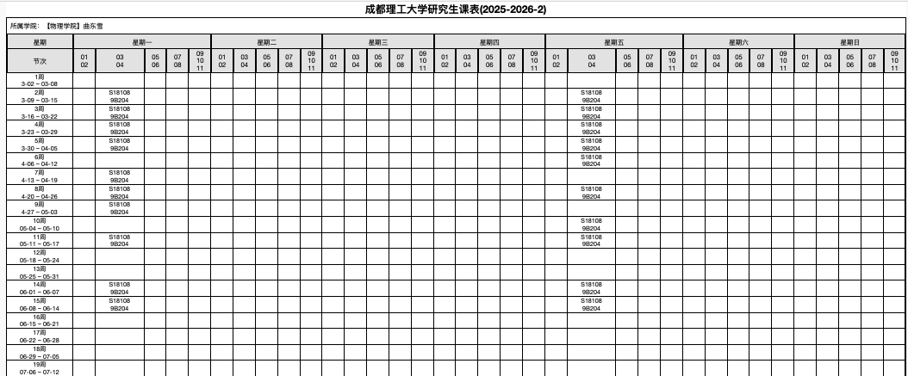

This page contains materials for the graduate-level course **Quantum Field Theory II**, taught in the **Spring semester of 2026**.

This course continues from **Quantum Field Theory I** and develops several central topics in relativistic quantum field theory. We study **Dirac fields and their quantization**, discrete symmetries in quantum field theory, and the **path integral formulation for fermionic fields**. 

The course then introduces **Maxwell theory and its quantization**, leading to the framework of **quantum electrodynamics (QED)**, with emphasis on quantum fluctuations and **renormalization**. Finally, we give a brief **introduction to gauge theory** and the role of symmetry in modern particle physics.

---

## 📅 Course Schedule

Below is the official course schedule for **Spring 2026**.

<!--  -->

---

## 📚 Course Materials

- 🗂️ [Syllabus](Syllabus.pdf)
- 📄 [Lecture Notes](lecture-notes.pdf)
- 📄 [Assignments](assignments.pdf)
- 📄 [Assignment Solutions](hw-soln.pdf)
- 💻 [Sample code and simulations](when applicable)

---

## 🧮 Topics Covered

The course develops several central aspects of relativistic quantum field theory, with emphasis on fermionic fields and gauge interactions. The main topics include:

- Dirac equation and spinor representations  
- Quantization of the Dirac field  
- Fermionic propagators and spin sums  
- Discrete symmetries in quantum field theory (C, P, T)  
- Path integral formulation for fermionic fields  
- Grassmann variables and fermionic functional integrals  
- Maxwell theory as a relativistic gauge field theory  
- Quantization of the electromagnetic field  
- Gauge symmetry and gauge fixing  
- Quantum electrodynamics (QED) and interaction with Dirac fields  
- Feynman rules and tree-level scattering processes in QED  
- Loop corrections and quantum fluctuations  
- Regularization and renormalization in quantum field theory  
- Ward identities and consequences of gauge symmetry  
- Introduction to non-Abelian gauge theory

---

## 🎯 Learning Objectives

By the end of the course, students will be able to:

- Understand the structure and quantization of fermionic quantum fields  
- Derive and work with propagators and Feynman rules for Dirac fields and QED  
- Apply the path integral formalism to fermionic fields using Grassmann variables  
- Analyze discrete symmetries (C, P, and T) in relativistic quantum field theory  
- Perform basic perturbative calculations in quantum electrodynamics  
- Understand the origin of quantum fluctuations and loop corrections  
- Apply regularization and renormalization techniques in quantum field theory  
- Recognize the role of gauge symmetry in modern particle physics

---

## 🔗 External Resources

- [Peskin & Schroeder – *An Introduction to Quantum Field Theory*](https://www.amazon.com/Introduction-Quantum-Field-Theory/dp/0201503972)

- [Zee – *Quantum Field Theory in a Nutshell*](https://press.princeton.edu/books/hardcover/9780691140346/quantum-field-theory-in-a-nutshell)

- [Perimeter Institute QFT Course Videos](https://www.perimeterinstitute.ca/video-library)

---

Please check this page regularly for **lecture notes, assignments, and announcements**.