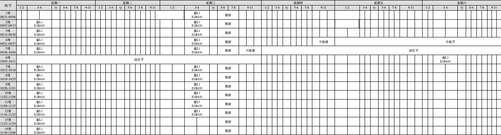

This page contains materials for the undergraduate course **Quantum Mechanics**, taught in the **Fall semester of 2026**.

---

## 📧 Contact Information

- Instructor: [dqu@cdut.edu.cn](mailto:dqu@cdut.edu.cn)
- Teaching Assistant: Min Sun (孙敏)
- Teaching Assistant Email: 3257887316@qq.com
- Office Hours: Wednesdays, 16:00--17:00
- Location: 北翼楼，5教8楼 5824（芙蓉餐厅对面）

---

## 📅 Course Schedule

Below is the official course schedule for **Fall 2026**.

---

## 📚 Course Materials

- 🗂️[Syllabus (PDF)](Syllabus.pdf)
- 📄[Lecture Notes](lecture-notes/)
- 📄[Assignments](assignments/)
- 📄[Assignment Solutions](assignment-solutions/)

---

## 🧮 Topics Covered

- Mathematical foundations of quantum mechanics
- Wave functions and the Schrodinger equation
- Operators, eigenvalues, and expectation values
- One-dimensional quantum systems
- Angular momentum and spin
- Central potentials and the hydrogen atom
- Time-independent perturbation theory
- Variational and semiclassical methods
- Identical particles

---

## 🎯 Learning Objectives

By the end of the course, students will be able to:

- Understand the postulates and mathematical framework of quantum mechanics
- Solve the Schrodinger equation for standard quantum systems
- Work with operators, commutators, and quantum measurements
- Analyze angular momentum and spin
- Apply approximation methods to systems without exact solutions

---

## 🔗 External Resources

- [Griffiths & Schroeter - *Introduction to Quantum Mechanics*](https://www.cambridge.org/highereducation/books/introduction-to-quantum-mechanics/990799CA07A83FC5312402AF6860311E)

- [Shankar - *Principles of Quantum Mechanics*](https://link.springer.com/book/10.1007/978-1-4757-0576-8)

- [MIT OpenCourseWare - Quantum Mechanics](https://ocw.mit.edu/search/)

---

Please check back regularly for updates to lecture notes, assignments, and announcements.
